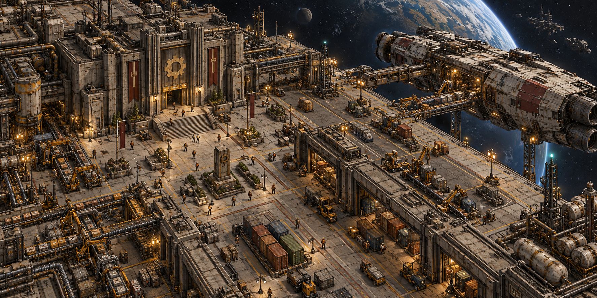
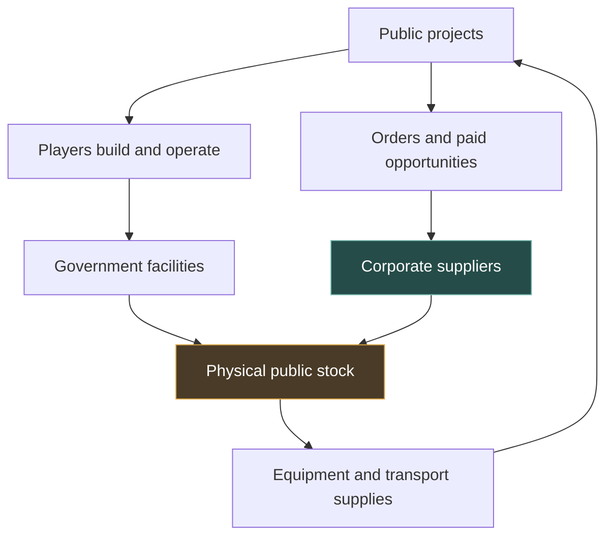
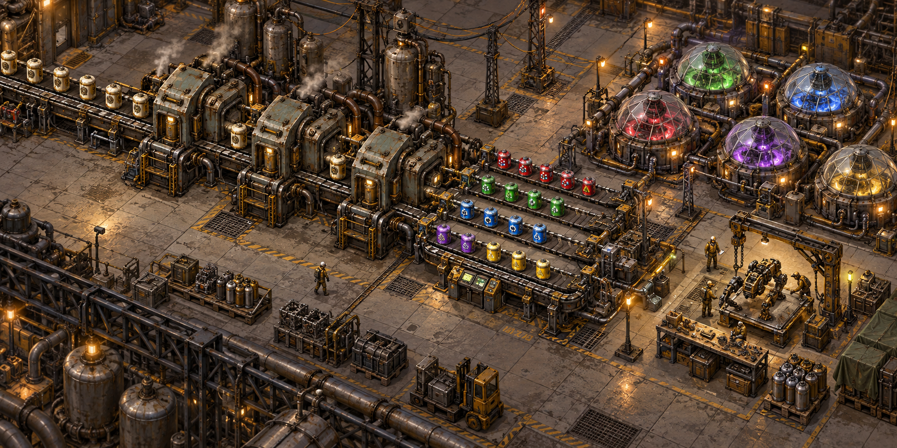
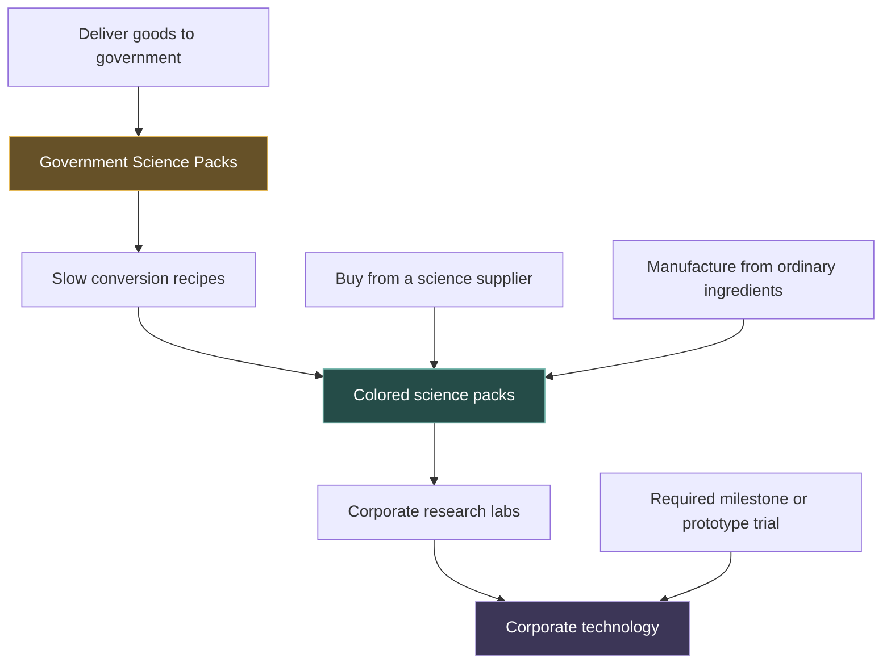
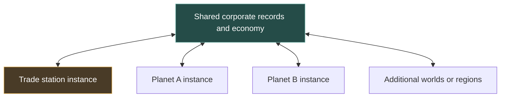

# STEEL AND STATE

### Build a company. Supply a civilization.

**A planned multiplayer mod collection for Factorio: Space Age.**

*Original AI-generated concept art. This illustration represents the intended atmosphere, not an in-game screenshot or finished asset.*

> You arrive at a station built from steel, machinery, and other people's work. A public factory needs an engineer. A shipping company needs a delivery crew. Somewhere below, a new industrial site is waiting for its first production line.
>
> Your first contract gets you started. What you build with it is up to you.

Steel and State imagines Factorio as an interconnected industrial society. Players work paid shifts, establish corporations, develop their own research, and trade goods that physically travel between factories, warehouses, planets, and space stations. Government provides a starting point and public infrastructure; corporations turn that foundation into a growing economy.

**Project status:** design and planning. No playable release or release date is announced. This page describes the intended experience. **Core direction** identifies the foundation of the design, **proposed** identifies mechanics still being shaped, and **exploratory** identifies larger possibilities that need technical validation. All gameplay features remain unimplemented.

---

## The experience at a glance

| Your ambition | Your opportunity |
| --- | --- |
| Join a team and build | Clock into a public or corporate worksite and earn wages |
| Run your own factory | Found a named corporation and develop an industrial specialty |
| Become the supplier everyone needs | Manufacture materials, components, science, or defense equipment |
| Keep the economy moving | Store, consolidate, and deliver physical shipments |
| Push technology forward | Build a corporate R&D department with its own research |
| Expand beyond Nauvis | Take contracts on supported planets and travel from the central station |
| Shape your server's experience | Choose cooperative commerce, regulated rivalry, or corporate warfare |

**Requires Factorio: Space Age.** Additional planet mods are being considered; a tested dependency list has not been selected.

### Explore the vision

[Your first shift](#01-your-first-shift) · [The station](#02-a-place-to-call-the-center) · [Corporations](#03-your-name-on-the-factory) · [Industries](#04-find-your-place-in-the-supply-chain) · [Government](#05-a-government-built-by-its-workers) · [Physical trade](#06-every-shipment-has-a-location) · [Research](#07-your-own-research-and-development) · [Defense](#08-protect-what-you-build) · [Play Types](#09-your-server-your-rules) · [Connected worlds](#10-a-universe-that-can-grow) · [Design philosophy](#the-design-philosophy) · [Feature register](#the-full-feature-register)

---

## 01 Your first shift

**Core direction · Employment, income, and a way into the world**

Start with a useful job. At the central hub, visit the government employment bureau or find an opening with an existing corporation. Accept an assignment, travel to the worksite, clock in, and help build the industrial world around you.

Government factory-building contracts provide the buildings needed for the work. The intended challenge is laying out production, connecting power and logistics, and getting a facility running. An employee can help operate and expand a business without first owning one.

Wages make that work a path to independence. Save toward founding a corporation, remain a valued member of a team, or take on public construction and logistics assignments. Becoming a company owner should be an opportunity rather than an obligation.

**Proposed employment details** include clear pay terms, employee roles, funded payroll, and a reasonable inactivity grace period. Planning a layout and supervising automation are real parts of factory work; the design should recognize them. Exact pay rates and shift rules remain open.

*Intended player journey. There is no fixed number of hours between these steps yet.*

---

## 02 A place to call the center

**Proposed centerpiece · A huge, walkable trade station**

The preferred starting location is a shared industrial space station. Imagine broad steel concourses, busy cargo bays, public offices, illuminated departure gates, and engineers crossing paths between assignments.

The station brings the economy into one recognizable place. You can find work, register a company, browse goods, collect supplies, and depart for a planet. Nauvis becomes one destination among the worlds where business happens.

| District | What brings you there |
| --- | --- |
| Arrivals concourse | Learn the server's rules and find your first opportunity |
| Government bureau | Accept work, construction projects, and public supply orders |
| Corporate exchange | Establish a business, acquire industry access, and find employees |
| Market hall | Compare offers and arrange purchases or deliveries |
| Warehouse district | Receive goods, reserve storage, and stage shipments |
| Passenger docks | Take government transport to an assigned destination |
| Industrial service areas | See the machinery that supports the station itself |

**Government taxis are part of the core direction.** They give workers and new businesses access to worksites before those businesses can build their own spacecraft. Round-trip access and assignment transport are important parts of the planned experience.

Passenger baggage, supplied equipment, fares, and schedules still need balancing. The intention is for bulk cargo to create commercial freight work. Players helping build new station districts is a further proposal: public expansion could become visible in the hub itself.

The walkable station's implementation and appearance are still being investigated. Concept art is a visual target, not a promise of a particular building set.

---

## 03 Your name on the factory

**Core direction · Independent corporations and industrial identity**

Create a corporation with its own name, faction, equipment, and research. Choose a specialization, establish production, find customers, and employ other players as the business grows.

Personal earnings and corporate funds serve different purposes. A company's machinery, contracts, inventory, and research belong to the business. Working a shift for another employer should not erase ownership of your own corporation.

The current design distinguishes several kinds of opportunity:

| Opportunity | What it means |
| --- | --- |
| Corporate charter | Establish the business and its identity |
| Industry contract | Gain entry into a specialization and its progression |
| Planetary concession | Develop an assigned location under agreed terms |
| Employment agreement | Work for a company at an agreed wage |
| Supply or service contract | Deliver goods, construction, storage, or transport |

*These labels are proposed terminology; exact fees, bundles, and ownership terms remain in design.*

Additional industry contracts allow diversification under one umbrella corporation. A steel producer could expand into machinery. A shipping company could develop its own equipment division. The goal is to make expansion possible while keeping specialist suppliers valuable.

**Buying equipment should not require learning to manufacture it.** Your transport company can purchase defenses from a defense contractor and science from a research supplier while concentrating on its own business.

---

## 04 Find your place in the supply chain

**Core direction · Specialization with room to expand**

Each industry should offer a reason for other players to know your company's name. These are the business roles being designed, with product lineups and research branches still to be finalized.

| Industry | What you provide | Where it can lead |
| --- | --- | --- |
| **Mining and metallurgy** | Extracted resources, plates, and steel | Specialist processing, extraction improvements, larger supply contracts |
| **Manufacturing** | Components, machinery, and industrial equipment | Advanced products and more efficient production |
| **Energy and chemicals** | Fuels, chemical products, batteries, and power equipment | New processing routes and infrastructure supply |
| **Freight and shipping** | Pickup, delivery, and interplanetary transport | Greater capacity, better propulsion, and more demanding routes |
| **Warehousing** | Storage, receiving, staging, and dispatch | Larger facilities and dependable logistics services |
| **Defense** | Weapons, ammunition, protection, and resupply | Improved products for factories and shipping operations |
| **Science manufacturing** | Physical colored science packs | Advanced pack production and long-term research customers |

A successful business can be narrow. A dependable ammunition supplier or science manufacturer should have a useful place alongside a large diversified corporation.

### Factories make everything

**No hand crafting is a foundational rule.** Buildings and crafted items come from production lines, suppliers, or issued equipment. Players still place equipment, configure machines, and design automation.

This makes starter packages and public construction supplies essential. A new company must be able to get its first process running without discovering that it needs to hand-craft a missing assembler or power component. Repair and manual mining rules are separate questions; the hand-crafting rule does not automatically prohibit them.

---

## 05 A government built by its workers

**Core direction · Public infrastructure with a physical resource base**

Government work should leave something behind. A mine produces materials. A factory replenishes public supplies. A warehouse creates capacity. A shipping contract puts equipment where the next project needs it.

Players expand that public foundation through construction, operation, and delivery contracts. Corporations can become suppliers to government projects while continuing to serve private customers.

*Economic relationships, not a production-volume chart. Quantities and budgets have not been balanced.*

Proposed public projects include mines, production plants, power facilities, warehouses, defensive installations, and freight deliveries. Government construction jobs issue their equipment; unused materials and accepted assets need clear ownership rules.

Government purchasing is intended to provide baseline demand and a way into the economy. It should also help recovery when a player or business loses access to essential equipment. The balance target is a public foundation that supports private opportunity without becoming an unlimited buyer of everything.

Whether government leadership is scripted, administrator-run, or eventually elected remains open.

---

## 06 Every shipment has a location

**Core direction · Prices are chosen by players; cargo moves through the world**

List your goods, choose your price, and arrange fulfillment. A customer might collect at your factory. You might offer delivery. A third corporation might earn its living moving the shipment between you.

Stock remains physically located in factories and warehouses. Materials on a distant planet are not automatically available at the central station. Transport turns that distance into work, costs, and business opportunities.

### Warehouses in space and on planets

Government station warehouses can hold public supplies and corporate goods under distinct ownership. Owning the building, owning its contents, and operating its loading equipment are different roles.

Warehouse contracts may cover construction, day-to-day operations, leased capacity, or preparation of a large project shipment. Storage space and receiving capacity should matter. A carrier needs a place to collect cargo and a destination ready to receive it.

### Shipping as a corporation

Freight companies could begin with local movement and grow into interplanetary routes. Spacecraft become working industrial assets: capacity, propulsion, power, and defense all support the business of delivery.

The proposed contract system records pickup, destination, quantity, fee, and completion terms. Deposited stock and held payment are being considered to make transactions dependable. Loss liability, insurance, partial delivery, spoilage, and detailed routing remain open design areas.

Asteroid protection gives shipping companies a reason to work with defense suppliers. Engine and hull development are part of the longer-term freight vision, with the exact equipment and mod integrations still to be chosen.

---

## 07 Your own research and development

**Current proposal · Earn science through your industry, then develop your company**

*Original AI-generated concept art. Machine shapes, pack designs, and lab layouts are illustrative.*

Each corporation has its own scientific progress. Its R&D department turns economic activity into new capabilities while remaining connected to the physical supply chain.

### Government Science Packs

Useful deliveries to central government trade can award **Government Science Packs** at product-specific rates. These packs are a special conversion resource. They cannot directly research technologies.

Recipes consume Government Science Packs as their **only material ingredient** and output conventional colored science packs. Different colors require different quantities and processing times. The conversion is intentionally a slower research supply path; expanded R&D can support more processing.

The resulting colored packs go into labs and satisfy the requirements of the corporation's chosen research. There are no final conversion ratios yet.

*The diagram combines supply routes and progression requirements. Trials apply to selected advances; they are not required for every research level.*

### Choose how to supply your labs

| Route | Why choose it? | What you invest |
| --- | --- | --- |
| **Convert government science** | Fund research through the work your industry already does | Earned packs and conversion capacity |
| **Buy colored science** | Obtain available supplies without developing a new industry | Money and transport |
| **Make colored science** | Control output and sell to other businesses | A science contract, facilities, and ingredients |

The starter-lab proposal would give eligible contracts a modest research foothold. A complete package may also include a converter and operating supplies; exact contents and which contracts qualify remain undecided. More labs and more conversion capacity solve different bottlenecks.

### Make science your business

A science corporation can import ingredients, manufacture colored packs, and supply other companies or government procurement. It can also acquire additional industry contracts to produce its own intermediates.

Manufacturing science does not grant every technology. Customers consume the appropriate packs in their own labs and retain their own research progress. Research becomes a meaningful expense through ingredients, power, factory capacity, shipping, and continued lab consumption.

### Prove the breakthrough

Milestones and prototype trials are proposed for major advances: a relevant test batch, a verified prototype, or an operational trial. Everyday upgrades should remain manageable. The intention is to connect breakthroughs to an industry's actual work without adding a checklist to every small improvement.

Common repeatable research could offer ongoing operational improvements to all corporations, including military improvements. Progress through supplied labs is the leading recommendation; free passive advancement and separate parallel queues are not settled features.

---

## 08 Protect what you build

**Core direction · An economy for defense equipment and services**

Factories face planetary hostiles. Shipping routes face asteroids. Defense contractors can supply the equipment and consumables that keep those operations productive—even on a cooperative server.

Proposed services include platform defense packages, factory perimeters, ammunition supply, installation, and maintenance. A customer can buy equipment without becoming a weapons manufacturer.

Defense research should produce meaningful saleable products. Improved ammunition or distinct equipment can carry its capabilities to a buyer. Corporate operating bonuses remain a separate layer: a seller's ordinary force-wide damage research does not automatically become a property of every turret it sells.

Corporate warfare adds another potential market, governed by the server's Play Type. Separate escort ships protecting another platform are not a verified feature and are not assumed by the shipping design.

---

## 09 Your server, your rules

**Core direction · Steel and State Play Types**

The framework is intended to support different communities through presets and individual settings. The names and exact policies below are proposed.

| Play Type | Intended character |
| --- | --- |
| **Cooperative Commerce** | Compete through industry, service, and pricing while corporate assets are protected |
| **Regulated Rivalry** | Add declared conflicts and configurable protected areas or combat windows |
| **Corporate Warfare** | Enable broader corporate conflict with explicit rules for raids and capture |
| **Custom** | Build a supported ruleset around your community |

A host/admin interface would bring government, corporate, labor, market, research, freight, and conflict settings together. Profiles should be saveable and configurable for dedicated servers. Players should be able to see the rules they are joining.

Settings need clear effects: some can change for new agreements, some require a restart, and some belong to world creation. In-game government office and server administration remain distinct responsibilities.

Space Age and the no-hand-crafting foundation remain part of this project's identity across Play Types. Detailed conflict enforcement needs its own testing; the existence of a preset does not establish that every possible attack or access path is handled.

---

## 10 A universe that can grow

**Exploratory · Connected planetary servers**

The long-term ambition is to distribute worlds across connected Factorio instances. Corporations would keep a persistent identity while operating on different planets, with coordinated contracts, money, research, and transport.

This is an architecture investigation, not a promise of limitless or seamless play. Each save has force and simulation limits. Passengers may need to reconnect and load another server at a transit boundary. Cargo and research transfers need reliable ownership and crash recovery.

The proposed approach gives a corporation one global identity and local forces only where it needs them. New planets or regions could be added as capacity grows. A crowded planet or station still needs practical limits.

Clusterio is being evaluated as a possible foundation. No server stack, planet list, transfer system, or scaling benchmark has been selected. The aim is a world that can grow responsibly as communities grow.

---

## The design philosophy

### 1. A useful company creates useful work

A mine gives a carrier cargo. A carrier buys protection. A defense manufacturer buys components. A science supplier helps each company improve. The economy succeeds when these relationships feel worthwhile.

### 2. Automation remains the heart of the game

Jobs and money should lead back to machinery, layouts, throughput, and logistics. With no hand crafting, production lines are the foundation of everyday activity.

### 3. Government provides a starting point and public infrastructure

Public work gets players involved and supplies essential services. Private companies should still win customers through specialization, availability, capacity, and price.

### 4. Distance and storage matter

A shipment has an origin, a destination, an owner, and a carrier. A warehouse provides real space. A purchasing decision can create a transport job.

### 5. Research supports an industrial identity

A company can advance through the value it produces. It can purchase science, convert government rewards, or expand into science manufacturing. Specialization should be viable without requiring every company to manufacture everything.

### 6. Small beginnings must stay playable

Starter equipment, basic research, public employment, and return transport should make a new player useful quickly. Recovery should be possible when a machine is lost or a supplier disappears.

### 7. Expansion should be a decision

Buying another industry contract expands possibilities, but requires investment. Working with a capable supplier should often be as sensible as bringing production in-house.

### 8. Build trust before adding scale

Clear ownership, predictable pay, understandable contracts, and reliable transfers matter more than a huge list of planets. The first complete economic loop has to work before the universe grows.

---

## A day in the economy

*An illustrative scenario, not a scripted quest or a promise of specific rewards.*

**Mara** arrives at the station and accepts a government construction job. The assignment supplies machinery and a seat on a taxi to the worksite. She helps commission a public factory, earns wages, and later uses her savings to establish a metallurgy company.

**Orion Freight** carries her first commercial steel shipment to a station warehouse. The buyer is a science manufacturer importing ingredients for a new production line. Orion uses part of its transport revenue to order ammunition from a defense contractor.

Mara also fulfills a government procurement order. Its Government Science Pack reward feeds her company's converter. Her lab begins an improvement while she considers whether buying additional colored science would bring the next breakthrough forward.

The government uses delivered materials for another public project. That project needs more equipment and a warehouse expansion. New work appears for the next engineer arriving at the station.

**One production line becomes part of several players' stories.**

---

## The full feature register

Everything below is planned or under exploration. This is a scope map, not a completion checklist.

| Feature group | Features in the design | Current standing |
| --- | --- | --- |
| Foundation | Space Age, multiplayer economy, factory-only crafting | Core direction |
| New-player experience | Central station arrival, public work, supplied equipment, government taxi | Direction; station implementation open |
| Employment | Clock-in shifts, wages, corporate teams, public worksites | Core direction; payroll details proposed |
| Corporate identity | Named companies, factions, independent research, starter equipment | Core direction |
| Corporate growth | Additional industry contracts and umbrella diversification | Core direction; pricing open |
| Planetary development | Site contracts, destination equipment, supported extra planets | Direction; location rights and mod set open |
| Government expansion | Player-built public factories, mines, warehouses, and supply infrastructure | Core direction |
| Government procurement | Useful resource demand, money/science reward terms, public reserves | Proposed balancing model |
| Player markets | Seller prices, pickup, delivery, commercial customers | Core direction |
| Transaction reliability | Stock reservations, held payment, acceptance, cancellation | Proposed mechanics |
| Physical warehousing | Planetary and station stock, receiving, staging, storage services | Core direction |
| Freight | Delivery contracts, carrier businesses, interplanetary cargo | Core direction; transfer details open |
| Shipping progression | Capacity, propulsion, hulls, power, protection | Longer-term direction; equipment unselected |
| Defense | Equipment manufacturing, supply, installation, resupply | Direction; service terms proposed |
| Government science | Reward packs converted by material-only recipes into colored science | Latest user proposal |
| Corporate R&D | Labs, starter research access, expanded processing capacity | Direction; package contents open |
| Science businesses | Ingredient-based colored-pack production and commercial sales | Core direction |
| Breakthroughs | Milestones and prototype trials | Proposed progression layer |
| Common research | Repeatable corporate operational improvements | Proposed; timing and queues open |
| Play Types | Cooperative, regulated rivalry, warfare, custom settings | Core framework direction |
| Administration | Host/admin GUI, profiles, player-visible rules, dedicated-server configuration | Direction; controls proposed |
| Connected servers | Global corporations, local forces, planetary instances | Exploratory architecture |
| Future possibilities | Station expansion, insurance, elections, subsidiaries, technology licensing | Ideas; not committed scope |

---

## What comes first

The first target is a small but complete story: arrive at a station, complete a supplied government assignment, travel back, establish a company, earn science, research an improvement, and trade with another corporation.

That initial loop can be built around one destination, one public worksite, one warehouse, one industry, and one research path. Science suppliers, defense products, more freight routes, additional planets, and larger server networks can follow once their foundations are proven.

There are no published wage rates, founding fees, science ratios, hardware requirements, player-capacity claims, or release dates yet. The visual diagrams explain relationships; they do not present measured performance or final balance data.

### Follow the design

This feature page is the player-facing overview. The underlying planning vault keeps decisions, alternatives, and open questions visible:

- [Design home](Home.md)
- [Current direction and decisions](planning/Decisions.md)
- [Research and science](design/Research%20and%20Science.md)
- [Station, planets, and transit](design/Station%20Planets%20and%20Transit.md)
- [Trade, warehousing, and freight](design/Trade%20Warehousing%20and%20Freight.md)
- [Cluster and force scaling](architecture/Cluster%20and%20Force%20Scaling.md)
- [Loose roadmap](planning/Roadmap.md)
- [Open questions](planning/Open%20Questions.md)
- [Dated dependency research and sources](research/Dependencies%20and%20Sources.md)
- [Concept-art provenance and prompts](assets/concept/README.md)

---

> **Steel and State**
>
> Start with a shift. Build a business. Give the next engineer somewhere to begin.

*An independent mod concept for Factorio: Space Age. Concept illustrations are original generated artwork, not official Factorio imagery or gameplay captures.*
