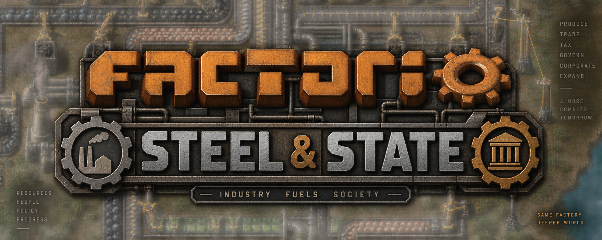

# Steel and State

A shared station. Public work. Independent corporations. Factories making everything. Goods and science moving through a player economy.

**[Read the illustrated feature overview](FEATURES.md)** — the full player-facing vision, industries, research, and design philosophy.

## Explore the design

- [First Corporation Walkthrough](design/First%20Corporation%20Walkthrough.md): startup loan, supplied site, first sale, and first research.

- [Vision and Player Journey](design/Vision%20and%20Player%20Journey.md)
- [Government and Contracts](design/Government%20and%20Contracts.md)
- [Corporations and Employment](design/Corporations%20and%20Employment.md)
- [Research and Science](design/Research%20and%20Science.md)
- [Trade Warehousing and Freight](design/Trade%20Warehousing%20and%20Freight.md)
- [Station Planets and Transit](design/Station%20Planets%20and%20Transit.md)
- [Defense Industry](design/Defense%20Industry.md)
- [Play Types and Configuration](design/Play%20Types%20and%20Configuration.md)

## Work on the plan

- [Decisions](planning/Decisions.md): user direction versus proposed details.
- [Open Questions](planning/Open%20Questions.md): choices we have deliberately left open.
- [Roadmap](planning/Roadmap.md): small experiments and the first complete loop.
- [Cluster and Force Scaling](architecture/Cluster%20and%20Force%20Scaling.md): multi-server exploration and engine limits.
- [Modules](architecture/Modules.md) and [Flow Sketches](architecture/Flow%20Sketches.md): conceptual stubs.
- [Dependencies and Sources](research/Dependencies%20and%20Sources.md): dated research, not an approved modpack.
- [Idea Template](planning/Idea%20Template.md): copy to explore a new idea.
- [Initial Brainstorm](archive/Initial%20Brainstorm.md): historical context, including superseded proposals.

## Next useful design exercise

Walk through one government factory job from arrival to payment, then spend its Government Science Packs on the corporation's first research. Specify only enough to spot missing equipment, ownership rules, or transport steps. See [Roadmap](planning/Roadmap.md).
