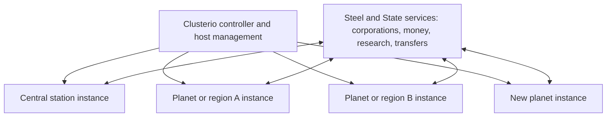

# Cluster and Force Scaling

Status: architecture proposal, researched 2026-09-26. The user wants to explore very large corporation counts and planets distributed across servers. No cluster is installed; no deployment or implementation is authorized by this exploration.

## Fundamental limits

Factorio currently supports at most 64 forces per save, including the three built-in forces. Surfaces in one save share that simulation and force namespace; creating more surfaces does not spread their simulation across machines or create new force capacity. Standard multiplayer uses deterministic simulation replicated by participating clients. A cluster therefore needs separate saves/instances with explicit transfers, not ordinary load balancing in front of copies of one save.

References: [LuaGameScript create_force](https://lua-api.factorio.com/latest/classes/LuaGameScript.html#create_force), [LuaForce](https://lua-api.factorio.com/latest/classes/LuaForce.html), [Factorio multiplayer architecture](https://www.factorio.com/blog/post/fff-76).

There is no literal unlimited capacity. Independent worlds can scale out as hardware is added, but each active factory, planet region, station, database, and transfer service has capacity limits.

## Global corporations, local forces

Recommended distinction:

- Permanent corporation ID: global identity, name, memberships, licenses, funds, and canonical research state.
- Instance ID: one independently simulated save; can host a planet, region, station, or small set of locations.
- Local force binding: corporation ID + instance ID → local Factorio force identity.
- Location ID: gameplay destination, independent of its current machine/instance address.

A corporation operating on three instances has three local force bindings to one global identity. Do not allocate every corporation on every instance. A company with no local assets, active work, or required local capabilities needs only a directory entry there.

Reserve force capacity for government and other system/mod needs. A tentative planning budget of 40–50 resident corporations per instance leaves headroom; it is not a benchmark or proven safe performance target. Count corporate factories and platforms even when their owners are offline. Their forces cannot simply be recycled while they still own entities or meaningful local state.

Reclaiming a force would require removing or migrating all associated assets, players, diplomacy, charts, and research state, then using supported engine operations. Do not depend on a nonexistent simple force deletion or merge unrelated live corporations to free slots.

At the central station, visitors can use a shared public visitor force while the custom GUI references their global company membership and warehouse allocations. Do not create a force for every visitor. This changes access and combat semantics and requires careful interaction restrictions; full corporate research bonuses cannot simultaneously be represented by one shared force.

If hundreds of independent corporate asset owners must coexist in one combat region, local force mapping is insufficient. Options are smaller regions/admission limits, or largely custom ownership/research/combat systems on shared forces. The latter is a major redesign, not the first recommendation.

## Proposed topology



Clusterio is an infrastructure candidate, not an approved dependency. Its official README describes multi-host instance management and plugins for research, inventories, chat, and shared storage; it currently recommends its 2.0 alpha. Existing plugins must be audited for corporate scope, chosen Factorio version, and Space Age item fidelity.

[Clusterio](https://github.com/clusterio/clusterio) supplies the communication and management foundation. Our proposed services add corporate semantics. Default shared storage should not become a universal gameplay inventory: storage remains attached to warehouses and shipments in our design. Do not assume generic research synchronization preserves separate corporate research.

[Universal Edges](https://mods.factorio.com/mod/universal_edges) demonstrates cross-server belt/fluid/power/train transfers. Its page lists support through 2.0. It is evidence of possible cross-server interaction, not verified seamless Space Age planet/platform partitioning. Prefer explicit spaceport boundaries initially.

## Distribution and load placement

Start with one active planet per instance, but keep region/sector IDs in the location model. A popular planet can later gain distinct regions if necessary. Moving an entire instance to a less busy host reallocates hardware; it does not divide that instance's simulation cost.

New-site allocation should consider measured update time/UPS headroom, memory, save size, players, force slots, and transfer load, not just player count. Empty servers can still contain expensive automated factories. Place new concessions before capacity is exhausted; relocate running instances with a planned save/stop/move/start workflow unless live migration is explicitly proven.

Distinguish many inhabited worlds of an existing planet type from infinitely many unique mod-defined planet types. Share a tested game version, mod set, and compatible startup settings across the cluster to avoid constant client changes and incompatible item/research definitions. Generating additional locations does not automatically generate balanced new technologies, routes, art, or planet prototypes.

A paused/offline world does not run factories normally. Choose between keeping productive worlds active or explicitly pausing their economy. Abstract offline production is another gameplay system and is not assumed.

The station can become its own hotspot. Plan for multiple station concourses or regional hubs sharing services if necessary; a single room containing unlimited players remains impossible.

## Research authority

Use one global corporation research record and versioned local projections. Simplest first experiment: designate one authoritative R&D instance per corporation, with other local forces receiving its unlocks. That restriction is a prototype proposal, not a player-facing decision.

Later, distributed labs can submit batched contributions to a canonical corporation/technology/level record. Contributions need unique IDs, durable acknowledgement, and rules for completion races, already-consumed packs, changed research selections, and disconnected instances. Never repeatedly sum full cumulative counters from different servers.

Ownership of the project should not change when an employee travels or clocks into another force. Sync only the relevant corporation's progress and unlocks. Government remains an independent research owner.

## Physical transfers and recovery

Passengers switch server sessions at a defined journey boundary; expect connecting and loading the destination save. Native moving platforms do not automatically continue across separate processes. Prototype manifest-based cargo handover first; arbitrary platform geometry, circuits, schedules, and inventories are a later serialization challenge.

```text
book a shipment:
    verify destination capacity and compatible content
    allocate one durable transfer ID
    lock source goods against use or duplicate dispatch

prepare departure:
    persist the source departure state and manifest
    authorize destination receipt under the transfer ID

receive:
    materialize the manifest once at the receiving dock
    persist a receipt; duplicate messages return the existing receipt

finish:
    acknowledge custody change and settle the delivery terms once
```

This sketches intent, not a complete atomic protocol. A database write and a Factorio save are not automatically one transaction. Crashes, acknowledgement loss, restoring an older save, and controller rollback need snapshot epochs and reconciliation to prevent duplicated or lost goods. Do not refund on timeout when destination receipt is uncertain.

Until receipt, cargo is locked at origin or attached to a single in-transit shipment, never available from a global pool. Preserve quality, spoilage, equipment grids, tags, and supported custom item metadata; reject unsupported cargo early rather than silently losing properties.

Players need an authoritative session/inventory lease so two connections cannot spend the same possessions. During central-service loss, local production may continue, but freeze new cross-server transfers, global spending, and uncertain ownership changes. Payroll and jobs need a defined funded/offline policy. Track retries and reconcile before resuming operations.

## First feasibility slice

1. Two headless instances using a minimal identical Space Age modpack; multiple instances may initially run on one machine.
2. One global corporation with a local force on each instance; verify independent second-corporation research.
3. One passenger trip and one crate shipment between docks, with a return trip.
4. One canonical research unlock applied to the correct forces only.
5. Crash/restart and old-save-restore tests during transfers; verify no duplicated cargo, wallet spending, or research contribution.
6. Measure update cost and force usage before selecting capacity thresholds or adding planets.

Open decisions: local corporation budget, sector admission, station visitor permissions, platform transfer fidelity, distributed R&D, outage behavior, and persistent-world operating cost.

See [Modules](Modules.md), [Corporations](../design/Corporations%20and%20Employment.md), [Trade](../design/Trade%20Warehousing%20and%20Freight.md), and [Decisions](../planning/Decisions.md).
