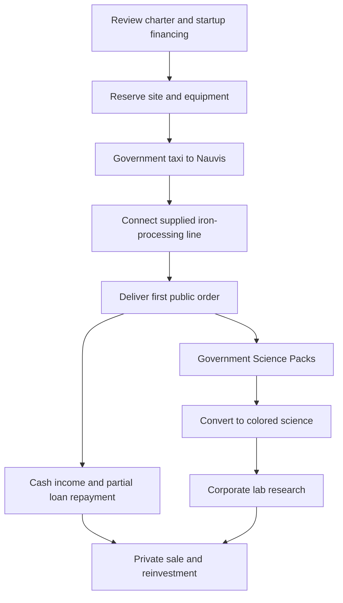

# First Corporation Walkthrough

**Design exercise · 2026-10-01 · Not a balanced scenario or implementation specification**

The user approved working through the first corporate contract using a small iron-processing company on Nauvis. This is a reference example, not a requirement that everyone start in metallurgy. The non-tradable startup loan is confirmed direction. Package contents, borrower structure, repayment percentages, and research objectives below are proposals.

## The experience we want to prove

A player leaves the central station with an understandable agreement, reaches a supplied worksite, produces goods without hand crafting, makes a first sale, repays part of the loan, and starts corporate research. The next step is a real choice: expand production, buy science, hire help, or save toward another industry.



## 1. At the corporate registry

The player chooses a name and reviews a **Basic Iron Processing** industry contract. The example business buys ore and fuel and sells iron plates; mining is a separate potential expansion. This preserves a useful relationship with resource suppliers.

Proposed prerequisites are completion of a short public orientation and no unresolved startup-loan entitlement. No mandatory work duration is selected. A prospective founder should be able to inspect the full offer before committing.

For this example, the corporation is the borrower and the founder is linked to its startup eligibility record. This is a proposed structure, not a decision about personal liability or co-founders.

The government loan is applied to eligible founding costs and supplied goods/services. It is not a tradable item or freely transferable cash allowance. The player sees the principal before accepting. Assets acquired with financing belong to the corporation under the agreement; foreclosure and resale restrictions remain undecided.

## 2. The offer on screen

A text wireframe for the eventual GUI:

```text
CORPORATE REGISTRY / BASIC IRON PROCESSING

Company name        [ player chooses ]
Destination         Nauvis / allocated industrial site
Business            Buy ore and fuel; manufacture iron plates
Funding             Non-tradable government startup loan

INCLUDED
Charter + industry access + site agreement
Processing equipment + initial inputs + local power service
Starter converter + one research lab
Outbound passenger trip + return entitlement
Equipment delivery to the site depot

FINANCIAL TERMS
Principal           [ itemized founding costs ]
Repayment           [ proposed share of completed cash sales ]
Interest            [ must be specified before acceptance ]
Other obligations   [ power, site, input, and delivery terms ]

FIRST CUSTOMER
Government order    [ quantity, price, science reward ]
Delivery point      [ local public receiving depot ]
Acceptance          [ item, quality, quantity, handover rules ]

[ View equipment ] [ View terms ] [ Accept ] [ Back ]
```

Production UI must contain actual agreed values rather than these placeholders. If the site, equipment, or first-order funding is unavailable, the offer stays unavailable before debt is incurred. Partial setup failure must cancel or unwind reservations without issuing duplicate equipment or leaving an unintended loan.

## 3. A complete starter manifest

Counts are intentionally provisional. Functional completeness matters first.

| Provision | Job | How it gets there |
| --- | --- | --- |
| Small batch of basic furnaces | Smelt purchased ore | Government stock delivered to site |
| Belts, inserters, poles, and chests | Connect production and storage | Same equipment shipment |
| Initial iron ore and suitable fuel | Produce the first agreed order | Reserved input shipment |
| Industrial site with a funded grid connection | Power handling, converter, and lab | Public utility service included initially |
| One basic science converter | Run government-pack conversion recipes | Corporate starter shipment |
| One research lab | Consume colored packs | Proposed one-time starter entitlement |
| Input/output depot access | Receive supplies and hand over goods | Site allocation and permissions |
| Repair packs and necessary spares | Recover minor faults without hand crafting | Starter maintenance supply |
| Passenger tickets | Get to the site and return | Government taxi booking |
| Essential recipe and technology access | Operate the issued equipment | Industry package; no advanced unlocks |

The power connection is an explicit scenario assumption, not free permanent power. Its initial allowance and later tariff must be listed. Converter power draw and recipe compatibility must be tested before finalizing the package. Keep early hostiles outside the first demonstration site through a stated protected-site policy; do not assume the player can survive with no defense provision.

Site supplies must cover an achievable first order and a margin for ordinary setup errors. Ongoing ore, fuel, spare parts, and power must be purchasable with sale proceeds. A public fallback supplier supports this loop when no private supplier is available.

## 4. Arrive and build

The player boards the government taxi. Bulk supplies are pre-positioned at the destination depot through a separately accounted shipment, not smuggled into unlimited passenger baggage.

At the site the player collects company equipment, places furnaces, routes inputs and outputs, and connects inserters, the converter, and lab to power. No required component is hand-crafted. Claiming the starter shipment records its issue once; reconnecting or reopening the contract cannot issue a second kit.

The initial production line can use manual inventory transfers while the player arranges automation. Whether to automate every transfer is a layout decision; prohibiting hand crafting does not prohibit carrying items.

## 5. The first customer and repayment

A finite government purchase order is reserved alongside the founding package. It provides an initial customer, not an unlimited guaranteed market. In this example its local Nauvis receiving depot settles on behalf of central government trade; onward transport to the station becomes a separate government freight job. This regional settlement is a proposal to avoid requiring a new smelter to own a spacecraft.

On verified delivery, ownership of the plates transfers to government. The company receives the agreed cash and Government Science Packs. Both rewards are recorded once. The science is physically handed over or placed in the company's local collection inventory; it does not instantly appear in the lab.

**Illustrative cash example — fictional units, not game balance:**

| Entry | Amount |
| --- | ---: |
| Outstanding startup principal before sale | 10,000 |
| Cash proceeds from the sale | 2,000 |
| Proposed repayment at 10% of cash proceeds | 200 |
| Cash retained by company | 1,800 |
| Planned replacement inputs, utilities, and handling | 900 |
| Cash available after those planned costs | 900 |
| Remaining loan principal | 9,800 |

For this illustration only, interest and other fees are zero. Government Science Packs are a separate reward and are not deducted for debt repayment. Cash retained is not profit until actual operating costs are accounted for.

Suggested repayment rule: deduct a disclosed fraction of settled corporate cash sales, capped at the outstanding balance; allow voluntary repayment. No wall-clock installment deadline is proposed for this example. Automated sales while an owner is offline still count as sales. Without sales, this particular repayment rule collects nothing; default and inactivity policy remain unresolved. Cancelled sales, refunds, intercompany transfers, and related-party transactions need explicit rules before code.

## 6. The first research

The founder chooses an eligible introductory processing improvement. Its name, effects, and pack requirements are placeholders; it must not be advertised as a particular existing technology until checked against the selected modpack.

For this exercise, choose a red-science-only project and size the first-order reward to cover its required conversions. The converter consumes only Government Science Packs as recipe material, takes time, and outputs actual red packs. A powered lab consumes those packs and advances only this company's research. It must be possible to complete this cycle using the starter power/input allowance.

A simple production milestone may require the first accepted batch. Save more elaborate prototype trials for a later tier; the first lab should not be locked behind technology it is needed to research.

The next R&D decision is visible: buy colored packs from another company to supply the lab sooner, expand conversion capacity through an R&D package, or retain money for factory growth. Conversion speed and lab speed are separate constraints.

## 7. The first private sale

The company lists a finite batch of deposited plates at a player-chosen price. Another corporation purchases it for pickup at the local depot. For the example, payment is held until the agreed handover; this settlement mechanism is still proposed.

The seller receives cash and the proposed loan deduction applies to that sale too. No Government Science Pack reward is implied for ordinary private trade. Private income can instead buy science, supplies, equipment, or services. If no buyer is online, the listing can remain open without blocking continued public work; do not fabricate a player transaction.

This is the first useful inter-company relationship: a resource supplier can replenish the smelter, a manufacturer can consume its plates, and a science producer can sell packs back to it.

## 8. Recovery cases to design

| Event | Required outcome; details to resolve |
| --- | --- |
| Disconnect during founding or supply collection | Resume or unwind once; no duplicate kit or debt |
| Starter machine lost | Reach replacement stock or public assistance without hand crafting |
| No private suppliers | Public input offer keeps the small loop viable within stated limits |
| First-order delivery delayed | Clear reservation/expiry rules; no surprise demand disappearance |
| Owner closes the company | Explicit settlement/recovery; debt is not silently erased |
| Server changes or restores an older save | Reconcile entitlements, goods, rewards, and repayments |
| Player cannot afford return travel | Honor included return entitlement |

## What this walkthrough must demonstrate

- The full equipment and permission chain works without hand crafting.
- The founder can see borrowing, supplies, first revenue, and repayment before accepting.
- One achievable sale can replenish essential operating costs and leave some choice.
- Physical supplies reach the correct site and belong to the correct party.
- Conversion and research are a useful first step rather than an immediate advanced unlock.
- The company has a reason to trade with other players after its introductory order.

Next discussion: choose loan repayment behavior, define the one-time starter entitlement, and decide whether public industrial plots include a power connection. These would turn the example into a more precise paper prototype.

Related: [Corporations and Employment](Corporations%20and%20Employment.md), [Government and Contracts](Government%20and%20Contracts.md), [Research and Science](Research%20and%20Science.md), [Roadmap](../planning/Roadmap.md).
